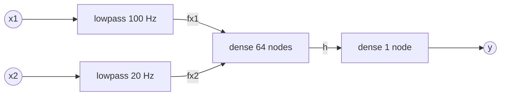

# FL language specification and reference implementations

FL, short for Flow Language, is a strongly typed, declarative, synchronous dataflow programming language intended for digital signal processing and machine learning models. FL stays close to the mathematical definitions of such models and leaves implementation details to the compiler, thereby simplifying and clarifying the programs considerably. To minimize the learning effort, the syntax is based on Python, which is arguably the most popular and common programming language in the world.

FL is only meant to model the signal processing and inference models. It can't be used to script data loading, training or validation.

### Why a new language? Keras and Python is fine!

If you're already happy with your Python workflow for DSP and machine learning modelling, FL will not be of any interest for you. However, if you're struggling with any of the following, read on to see how FL offers a better workflow:

- *Convoluted code*. Python is a scripting language that works well for controlling your data loading, training, validation and deployment, but it's not ideal for defining mathematical models. The code gets convoluted and the actual math gets buried among control statements, making it difficult to read and maintain. See for example [the source code for Keras' simple RNN layer](https://github.com/tensorflow/tensorflow/blob/master/tensorflow/python/keras/layers/recurrent.py), whose mathematical definition is just *y* = tanh(*Wx<sub>t</sub> + Uy<sub>t-1</sub> + b*).
- *Array shapes and runtime errors*. With Keras and Python, you typically work with tensors of multiple dimensions. Some dimensions concern the model data flow, while some concern training aspects such as batches and samples - and sometimes there's the time dimension on top of that. To add insult to injury, different functions and layers expect different array shapes, requiring lots of reshaping. This often leads to incomprehensible runtime errors deep down in TensorFlow when some arrays don't match. See [how people are struggling with Keras array shapes](https://stackoverflow.com/search?q=keras+array+shape) on Stack Overflow.
- *Deployment to edge devices*. If you need to deploy your trained machine learning model to an edge device, for example a smartphone or even a tiny device with a microcontroller, with Keras and Python your primary option is to use TensorFlow Lite, which doesn't support all layers, may be difficult to build into your target project and may cause significant time, power and space overhead. For your DSP models, the only option is to reimplement them in the target language, for example C, which means additional work and the risk of implementation bugs.

## Language features

### Declarative

FL is declarative, which means it expresses the logic and arithmetic operations without describing the control flow. Concretely, one declares functions that contain parameters and formulas in any order. This stands in contrast with imperative languages, where the algorithm is described with an ordered sequence of statements. Statements like `x = x + 1` are illegal in FL, since it's not a valid formula.

```python
def dense(x, N):
    param W = glorot_uniform(N, len(x))
    param B = zeros(N)
    y = sigmoid(matmul(W, x) + B)
    return y
```

### Synchronous

FL is synchronous, which means that all computations are synchronized with a global clock, typically the arrival of new input. The entire model is executed for every input or time step, so there is no need to loop over inputs as in Python. Statefulness is introduced by using the delay operator `[t-n]`, which refers to a variable value at a previous time step. `t` is a keyword in FL and refers to the number of time steps since the beginning of data.

```python
def lowpass(x, FC, TS):
    C = 2 * PI * FC * TS / (1 + 2 * PI * FC * TS)
    y = x if t == 0 else C * x + (1 - C) * y[t-1]
    return y
```

### Dataflow

FL is a dataflow langauge, which means that it describes a computation graph where data flows through operations. Functions are used to describe composite operations in the graph. Notice that the states and parameters of the function blocks are separate (not shared) by default.

```python
def main(x1, x2):
    TS = 0.001
    fx1 = lowpass(x1, 100, TS)
    fx2 = lowpass(x2, 20, TS)
    h = dense([fx1, fx2], 64)
    y = dense(h, 1)
    return y
```



Since most machine learning frameworks are based on dataflow models, translation from FL to such models is straightforward.

### Strongly typed

FL is strongly typed, which means that all data types are resolved and checked at compile time. Even array dimensions, which are constant throughout execution, are determined and checked at compile time. Type errors and array shape mismatch can therefore not happen at runtime. FL allows precise type annotations on all variables. Moreover, inputs and formulas can be declared `const`, which means that their values must be computed at compile time, so they won't use any memory or computation resources during training or at runtime.

```python
def dense(x: float[], const N: int) -> float:
    const M = len(x)
    param W: float[N, M] = glorot_uniform(N, M)
    param B: float[N] = zeros(N)
    y = sigmoid(matmul(W, x) + B)
    return y
```

### Compact array manipulation

Arrays are built-in primitives in FL, rather than lists as in Python. Lists don't exist in FL. Python's list manipulation syntax, including initialization and comprehension, can be used in FL to manipulate arrays.

```python
def fir(x: float) -> float:
    return convolve(x, [0.1, 0.2, 0.4, 0.2, 0.1])

def convolve(x: float, kernel: float[]) -> float:
    const K = len(kernel)
    return sum([x[t-i] * kernel[i] for i in range(K)])
```

For Python compatibility, the FL parser also accepts standard numpy syntax for array manipulation.

## Examples

### Butterworth filter

```python
def butterworth_lp(x: float, const FC: float, const FS: float) -> float:
    # Fourth order low pass Butterworth filter
    
    # Compute intermediates
    const C = 1 / tan(PI * FC / FS) # Pre-warping
    const A = sqrt(2 - sqrt(2))
    const B = sqrt(2 + sqrt(2))
    
    # Compute filter coefficients
    const A0 =  1 * C**4 + 1 * C**3 * (A + B) + 1 * C**2 * (A * B + 2) + 1 * C * (A + B) + 1
    const A1 = -4 * C**4 - 2 * C**3 * (A + B)                          + 2 * C * (A + B) + 4
    const A2 =  6 * C**4                      - 2 * C**2 * (A * B + 2)                   + 6
    const A3 = -4 * C**4 + 2 * C**3 * (A + B)                          - 2 * C * (A + B) + 4
    const A4 =  1 * C**4 - 1 * C**3 * (A + B) + 1 * C**2 * (A * B + 2) - 1 * C * (A + B) + 1
    
    # Do filter 
    y = 0 if t < 4 else (x[t] + 4*x[t-1] + 6*x[t-2] + 4*x[t-3] + x[t-4] - A1*y[t-1] - A2*y[t-2] - A3*y[t-3] - A4*y[t-4]) / A0
    return y
```

### Gaussian filter

```python
def gaussian(x: float, const N: int) -> float:
   # Compute symmetric array of gaussian function values (N(0,1) over range -3..3)
   const C = 6 / (N - 1)
   const GAUSS = [exp(-(i * C - 3) ** 2) / sqrt(PI) * C for i in range(N)]
   
   # Gather last N values of x in an array
   last_N_x = [x[t-(N-i-1)] for i in range(N)]
   
   # Convolve gaussian with last N values
   return dot(GAUSS, last_N_x) / sum(GAUSS)
```

### LSTM

```python
def lstm(const N: int, x: float[]) -> float[N]:
    # Parameters
    const M = len(x)
    param WI = glorot_uniform(N, M)
    param UI = orthogonal(N, N)
    param BI = zeros(N)
    param WF = glorot_uniform(N, M)
    param UF = orthogonal(N, N)
    param BF = zeros(N)
    param WO = glorot_uniform(N, M)
    param UO = orthogonal(N, N)
    param BO = zeros(N)
    param WG = glorot_uniform(N, M)
    param UG = orthogonal(N, N)
    param BG = zeros(N)
   
    # LSTM
    i = sigmoid(matmul(WI, x[t]) + matmul(UI, h[t-1]) + BI)
    f = sigmoid(matmul(WF, x[t]) + matmul(UF, h[t-1]) + BF)
    o = sigmoid(matmul(WO, x[t]) + matmul(UO, h[t-1]) + BO)
    g = tanh(matmul(WG, x[t]) + matmul(UG, h[t-1]) + BG)
    c = f[t] * c[t-1] + i[t] * g[t]
    h = o[t] * tanh(c[t])
    return h
```

## Workflow

*Note: None of these tools exist at the time of writing. They are examples of what future FL-based tools could look like.*

### With Python-based compiler

1. Prepare your data with any tool, for example [Flow CSV Editor](https://www.waveworks.dk/flow/).
1. Write your DSP and machine learning models in FL. Typically you'll write two top-level functions, for example `features()` for the DSP and `main()` for the machine learning model.
1. In Python, use the FL compiler to compile your code to FL function objects. Fix any errors that the compiler outputs.
1. Load your data and preprocess it with the `features` function object.
1. Convert the machine learning function object `main` to a Keras model.
1. Train the model with Keras.
1. Transfer the weigths back to the `main` function object.
1. Use the FL code generator to generate code in the target language from the FL function objects.

```python
import tensorflow as tf
import fl

# Compile functions features() and main() in the file main.fl
# Compiler errors will be printed here, if any.
features = fl.compile("main.fl", "features")
main = fl.compile("main.fl", "main")

# Load data and preprocess it with features()
x, y = load_data() # Load from data file and format as numpy arrays
x = features(x)

# Convert the main function to a Keras model
model = fl.to_keras(main)

# Train it with Keras
model.compile(optimizer=tf.keras.optimizers.Adam(), loss=[tf.keras.losses.binary_crossentropy])
model.fit(x=x, y=y, epochs=100)

# Transfer the weigths back to the main function
main.set_parameters_from_keras_model(model)

# Generate C code for features and main()
fl.generate_code(features, "C", "features.c")
fl.generate_code(main, "C", "main.c")
```

### With IDE

1. Load the raw data into the tool and prepare it with the integrated data editor.
1. Write your DSP and machine learning models in FL with the integrated code editor. Typically you'll write two top-level functions, for example `features()` for the DSP and `main()` for the machine learning model. The tool automatically processes your data and shows the result graphically.
1. Write any custom loss function in FL if desired.
1. Train the model using the integrated parameter optimizer. The tool shows the training progress graphically.
1. Configure the code generator and generate code in the target language from the FL functions. 

## Other synchronous dataflow languages

Synchronous dataflow languages are not new - here's a list of a few other ones:

- [Simulink](https://www.mathworks.com/products/simulink.html)
- [LabVIEW](https://www.ni.com/en-us/shop/labview.html)
- [Lustre](https://en.wikipedia.org/wiki/Lustre_(programming_language))/[SCADE](https://www.ansys.com/products/embedded-software/ansys-scade-suite#tab1-2)
- [VHDL](https://en.wikipedia.org/wiki/VHDL)
- [Verilog](https://en.wikipedia.org/wiki/Verilog)

FL complements these languages primarily by its Python syntax and its built-in support for trainable parameters.